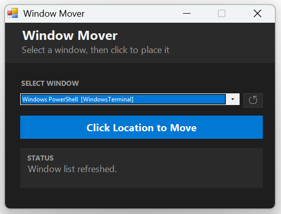

# Why I Made This (*I was mad*)
Ever have a problem with Windows 11 and find [endless comment threads like this one](https://learn.microsoft.com/en-us/answers/questions/4139775/app-runs-off-screen-in-windows-11?page=18#answers)?

I had a window stuck off-screen that I couldn't move, and so I put this together to solve my own problem.

I've had the problem a few times now, so thought it might be worth sharing to others that might need this.

# What is it For
## The Problem
Does this sound like you:
1. Sometimes when you unplug your computer from a dock with multiple displays, Windows 11 gets confused 😱
2. Windows 11 wants to keep opening the window where it "was", but...
3. ...Where it "was", is located on that docked display... which no longer exists
4. Windows 11 don't care about any of that and just keeps opening your window off-screen 🦡
5. Windows 11 also conveniently provides no universal way to MOVE a window that you CAN'T click or interact with through the taskbar.

## The Solution
You have probably already wasted a lot of time, with a bunch of malarkey hotkeys, pressing shift and right-clicking jim-bob, WIN+TAB crossbar-double-kickflip, ALT+TAB-(2/WUMBO_W_ING), whatever.

None of the keyboard/mouse jutsu worked, so now this.

This powershell script lets you select an open window and move it to the coordinates you click, on your current screen.

# The fastest way to use this (if you're in a hurry)
Really just 2 steps, broken down into 6 sub-steps (for the instructionally limited among us)

## Open Powershell ISE & Paste Script
1. On your computer, search for & open "Windows Powershell ISE"
2. Copy the `.ps1` script and paste it into the untitled text box in Powershell ISE
3. Click the green "play" icon to run the program

- If using multiple displays, *move the "Window Mover" into that display first!

## Use the Program
1. Use the "Select Window" drop-down box to pick the window you want to move (click ↺ to update the list of running windows)
2. Press "Click Location to Move"
3. Anywhere you click is where the TOP-LEFT corner of your window will be moved to

## Important Things to Know
- Some windows on your desktop run as elevated processes. To move those, choose "Run as Administrator" for starting Powershell ISE and then run the script (so it is also Elevated).
- If you are moving something between multiple displays you have configured, move "Window Mover" into that display's view before using "Click Location to Move". The windows may not move exactly where you click, otherwise (probably confusion with DPI / scaling, might fix some time this century)
